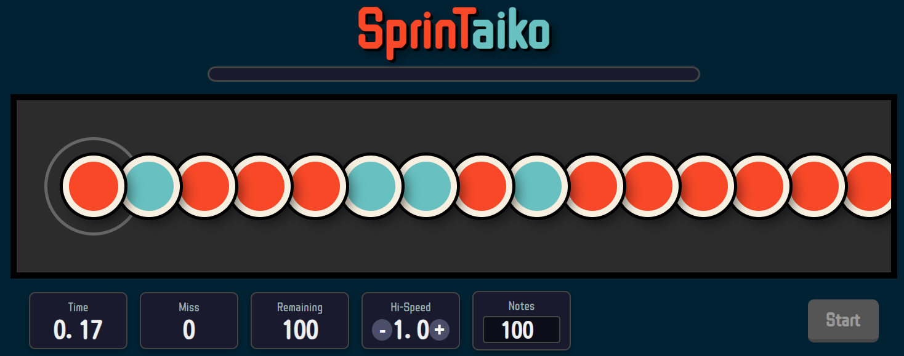

# 🥁 SprinTaiko (Sprint + Taiko)

A web-based rhythm game inspired by "Taiko no Tatsujin" and typing practice software.

[**🎮 Play SprinTaiko Now! 🎮**](https://kirumi-shibu.github.io/SprinTaiko/)

The goal is to hit the notes that flow from the right as quickly and accurately as possible. It's designed to be a fun way to practice and measure your typing speed and rhythm skills.

## ✨ Features

- **Adjustable Hi-Speed:** Change the speed at which notes travel.
- **Customizable Note Count:** Set the number of notes for each game session (from 10 upwards).
- **Key Configuration:** Freely assign keys for "Don" and "Ka" actions.
- **Bar Line Display:** Display bar lines at custom intervals to help with rhythm.
- **Scoring and Ranking:**
  - Your score is based on speed and accuracy (with a heavy emphasis on accuracy!).
  - The top 5 scores, along with miss counts, are saved locally in your browser.
- **Sound Customization:**
  - Adjust the master volume.
  - Upload your own sound files for "Don", "Ka", "Miss", and other game sounds.
- **Share on X:** Post your results directly to X (formerly Twitter) from the result screen.
- **Persistent Settings:** Your Hi-Speed, note count, sound settings, and key configurations are saved in your browser for the next time you play.

## 🎮 How to Play

1. Press the **Start** button or the **Enter** key to begin the game.
2. When the notes reach the target circle on the left, press the corresponding keys.
    - Default keys are <kbd>F</kbd>/<kbd>J</kbd> for **Don** (red) and <kbd>D</kbd>/<kbd>K</kbd> for **Ka** (blue). You can change them in the settings.
3. The game ends when all notes have been processed. Your score will be calculated based on your speed (HPS - Hits Per Second) and accuracy (`Score = HPS × Accuracy^3 × 10000`).
4. You can press the **Esc** key at any time to interrupt and reset the game.

## 🛠️ Built With

- HTML5
- CSS3
- JavaScript (ES6+)
- Web Audio API

---

> **A Note on Development**
>
> This project was brought to life through an intensive and creative process of "vibe coding" in collaboration with **Gemini Code Assist**. From the initial concept to the final refactoring, every step was a joint effort, blending human ideas with AI-driven implementation.
>
> And yes, you guessed it—Gemini wrote this README too! :)
